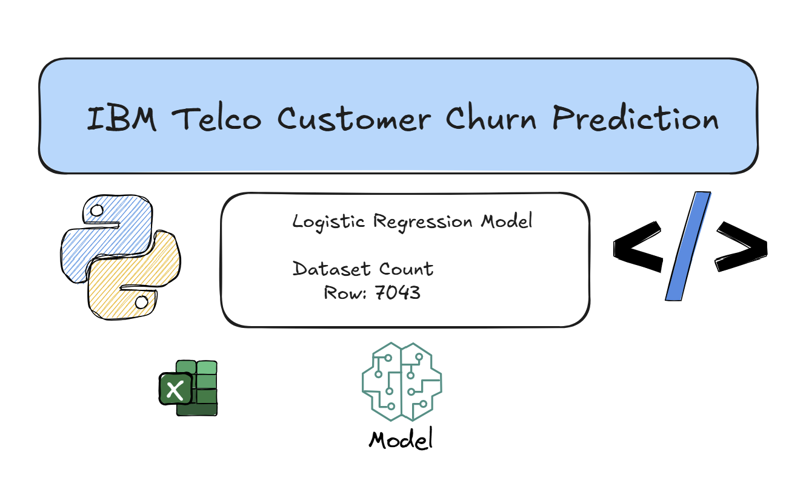

# IBM Telco Customer Churn Prediction



## Project Structure

```text
telco-customer-churn
|-- data
|   |-- processed
|   |-- raw
|       |-- telco.csv
|-- models
|   |-- model.pkl
|   |-- scaler.pkl
|-- notebooks
|   |-- 01_data_explore.ipynb
|-- src
|   |-- schemas
|       |-- inference_schema.py
|   |-- templates
|       |-- index
|   |-- inference.py
|   |-- preprocessing.py
|   |-- simple_inference.py
|   |-- train.py
|-- requirements.txt
|-- .gitignore
|-- README.md
```

## Gets Started

```bash
git clone <repo>
cd <repo>
```

### Create Folders

```bash
mkdir data/processed
mkdir data/raw
```

### Create Virtual Environments

```bash
python -m venv .venv
```

For Windows

```bash
.venv\Scripts\activate
```

For Ubuntu

```bash
source .venv/bin/activate
```

Install Requirements

```bash
pip install -r requirements.txt
```

Start with uvicorn

```bash
cd telco-customer-churn\src
python inference.py
```

Goes to localhost at port 342.

Click to for [Swagger UI](http://127.0.0.1:342/docs#/).

Click to for [Main Page](http://127.0.0.1:342/).
